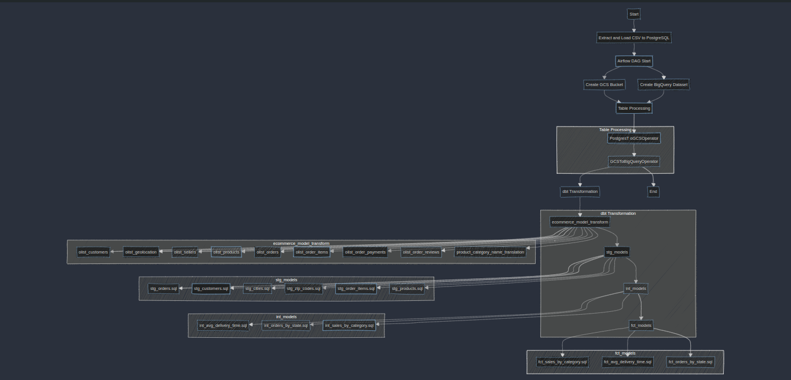
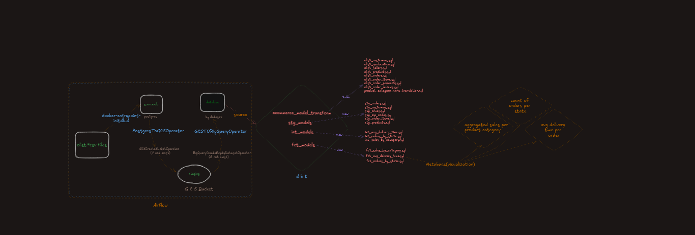
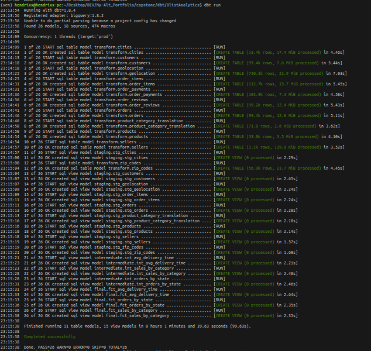
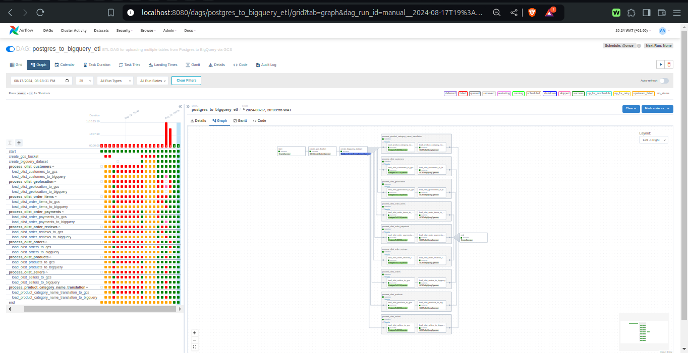
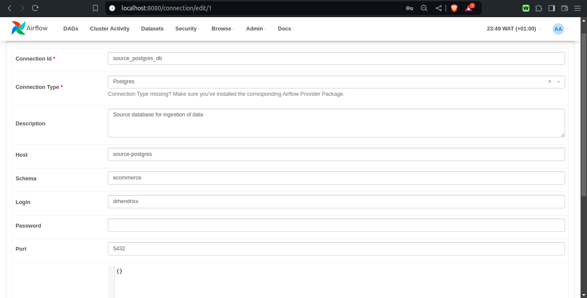
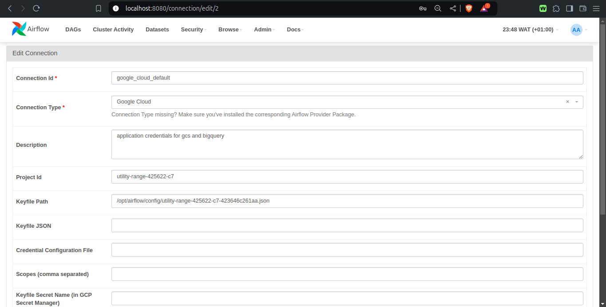
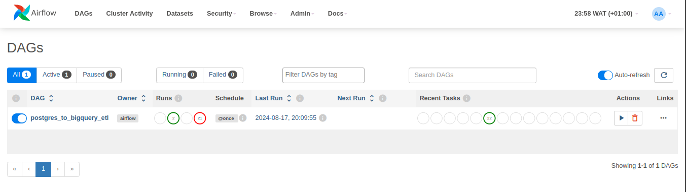
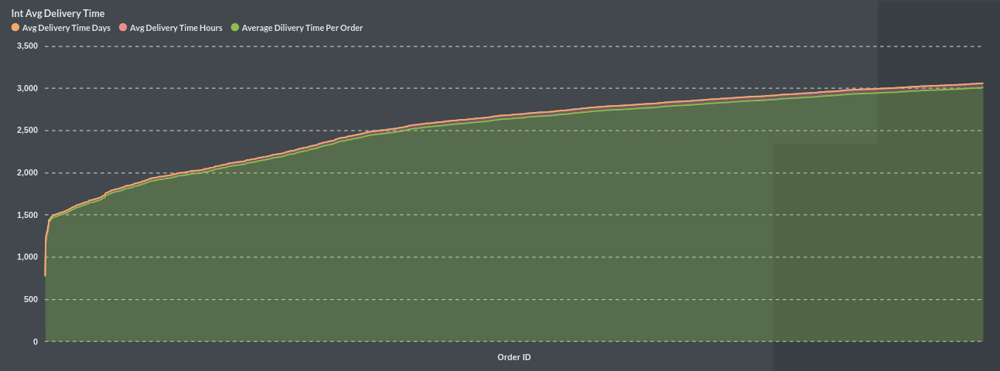
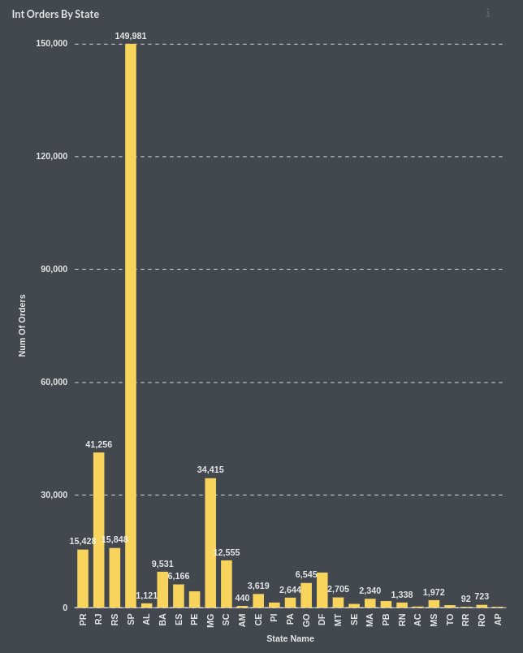
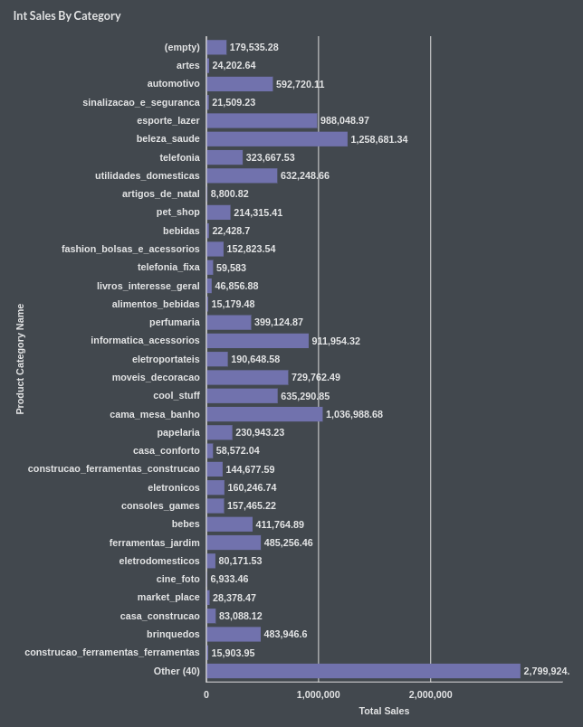

# Alt School Africa
---
Ochestrating the injestion and loading of data from postgres to bigquery and analytics with dbt

---

###### [ELT diagram flow](https://shorturl.at/EBJK2)
---


                              Table Of Contents

1. Alt School Africa
2. Task Flow
   - ELT Diagram Flow
3. Synopsis
4. Docker & Docker Compose
   - Services
     - Airflow Postgres Database (airflow-postgres)
     - Source PostgreSQL Database (source-postgres)
     - Redis (redis)
     - Flower (flower)
     - dbt (dbt)
     - Airflow Webserver (airflow-webserver)
     - Airflow Scheduler (airflow-scheduler)
     - Airflow Worker (airflow-worker)
     - Airflow Triggerer (airflow-triggerer)
     - Airflow Initialization (airflow-init)
5. ELT Process
   - Extraction
   - Load
     - PG to GCS
     - GCS to BigQuery
   - Transform
     - Models Structure
     - Models
       - ecommerce_model_transform
       - stg_models
       - int_models
       - fct_models (final models)
6. Orchestration
   - Functionalities of the DAG
     - Imports and Configuration
     - DAG Definition
     - Task Structure
     - Table Processing
     - Error Handling
7. How to Run the Project
8. Conclusion
   - File Structure

---


###### ELT architecture

---

                              Synopsis

In the realm of data engineering, building robust data pipelines is a fundamental practice for ensuring seamless data flow and transformation across systems. This project showcases the development of a comprehensive end-to-end ELT (Extract, Load, Transform) pipeline that integrates several key technologies to efficiently handle data from ingestion to visualization.

Components Integrated:
  - postgresSQL
  - Airflow
  - DBT
  - Metabase
  - Docker, Docker-compose.

---

                              Docker & Docker Compose

**[docker-compose.yml](docker-compose.yml)**


                              services

- _Airflow Postgres Database (`airflow-postgres`)_
  
This service sets up the PostgreSQL database for Airflow.

- _Source PostgreSQL Database (`source-postgres`)_
  
This service manages the source PostgreSQL database used for data ingestion.

- _Redis (`redis`)_
  
Redis is used as the message broker for the CeleryExecutor in Airflow.

- _Flower (`flower`)_
  
Flower provides a UI for monitoring the Celery workers in Airflow.

- _dbt (`dbt`)_
  
This service builds a Docker image that includes dbt with all available adapters.

- _Airflow Webserver (`airflow-webserver`)_
  
The Airflow webserver provides the UI for Airflow.

- _Airflow Scheduler (`airflow-scheduler`)_
  
The Airflow scheduler triggers tasks to be executed.

- _Airflow Worker (`airflow-worker`)_
  
Celery workers execute the tasks triggered by the scheduler.

- _Airflow Triggerer (`airflow-triggerer`)_
  
The triggerer handles deferred tasks in Airflow.

- _Airflow Initialization (`airflow-init`)_
  
This service runs initialization scripts to prepare the Airflow environment.

---

                              ELT

- **Extraction**
  - leverages `docker-entrypoint-initdb.d` 

`docker-entrypoint-initdb.d` is a special directory in PostgreSQL Docker containers. When the container starts for the first time and initializes the database, it automatically executes any `.sql`, `.sql.gz`, or `.sh` scripts placed in this directory.
In your Docker Compose setup:

A local `init.sql` file is mounted file to `docker-entrypoint-initdb.d/init.sql` inside the container.
This `init.sql` script contains SQL commands to create tables and load data from CSV files.

When the container starts for the first time, it will automatically run this `init.sql` script.
This approach allows for automating the process of setting up the initial database schema and populating it with data.

- **Load**
  - PG to GCS:
  
    - Uses PostgresToGCSOperator
    - Extracts data from Postgres using a SQL query
    - Loads this data into Google Cloud Storage (GCS) as JSON files

  - GCS to BigQuery:

    - Uses GCSToBigQueryOperator
    - Reads the JSON files from GCS
    - Loads the data into BigQuery
    - Automatically detects the schema of the incoming data
    - Creates the table if it doesn't exist, or truncates and replaces data if it does
    - Each file is named with the table name and a timestamp


- **Transform**

In the transformation phase, dbt (data build tool) is leveraged to process the data loaded into BigQuery. The primary approach taken is normalization to _Second Normal Form (2NF)_.

The transformation focuses on normalizing the data to 2NF, which:

 - Eliminates partial dependencies
 - Reduces data redundancy
 - Improves data integrity


The [normalized structure](./imgs/olist_2NF_schema.png) is designed to support analytics questions about the data.


This approach:
- Organizes data into separate tables based on their dependencies
- Establishes clear relationships between tables using primary and foreign keys
- Prepares the data for efficient querying and analysis


###### Models
   
1. _ecommerce_model_transform_

  this models sub-directory containes the models for normalizing the olist ecommeece dataset to improve data quality. this models build under a schema called: `transform`. these models **materialize** `table`

2. _stg_models_

  this models subdirecotory holds the staging models of 6 model which **materialize** as `view`. models here are build under a schema: `staging`

3. int_models

  this subdirecotiry holds the intermediate models of 3 model which **materialize** as `view`. models are build under a schema: `intermediate`.

  these models are:
  - *int_sales_by_category* - this models finds `Aggregated sales data by product category`.
  - *int_avg_delivery_time* - this models `calculates the average delivery time for each order`
  
    this model find the average dilivery time in :
    -  minutes
    - hours
    - days
    in ascending order
  - _int_orders_by_state.sql_ - : this model `Counts the number of orders per state`

4. fct_models(final models)

these are the final models that reference the intermediate models. futher analytics can be performed on this models


build models

---

                              Ochestration

  ```python
  with DAG(
    'postgres_to_bigquery_etl',
    default_args=default_args,
    description='ETL DAG for uploading multiple tables from Postgres to BigQuery via GCS',
    schedule_interval='@once',
    catchup=False,
    max_active_runs=1
  ) as dag:
  ```

This dag automates an ETL process to move data from PostgreSQL to Google BigQuery via Google Cloud Storage. It operates as follows:

1. Loads configuration from a YAML file.
   ```python
   def load_config():
     """
     Load configuration from YAML file.
     """
     try:
         with open('./config/config.yml', 'r') as file:
             return yaml.safe_load(file)
     except Exception as e:
         logger.error(f"Failed to load configuration: {str(e)}")
        raise
   
   config = load_config()
   ```

2. Creates a GCS bucket and BigQuery dataset if they don't exist.
  ```python
  # Create GCS bucket if it doesn't exist
    create_bucket = GCSCreateBucketOperator(
        task_id='create_gcs_bucket',
        bucket_name=GCS_BUCKET,
        project_id=GCP_PROJECT_ID,
        location=GCS_LOCATION,
        storage_class='REGIONAL',
        gcp_conn_id=GCP_CONN_ID
    )

    # creates a bigquery dataset if it dosent alrady exist
    create_dataset = BigQueryCreateEmptyDatasetOperator(
        task_id='create_bigquery_dataset',
        dataset_id=BQ_DATASET,
        project_id=GCP_PROJECT_ID,
        location=BQ_LOCATION,
        exists_ok=True,
        gcp_conn_id=GCP_CONN_ID
    )
  ```

3. For each specified table:
   - a. Extracts data from `Postgres` and loads it into `GCS`.
     ```python
     to_gcs_task = PostgresToGCSOperator(
          task_id=f'load_{table}_to_gcs',
          postgres_conn_id=POSTGRES_CONN_ID,
          gcp_conn_id=GCP_CONN_ID,
          sql=f'SELECT * FROM cpstn.{table}',
          bucket=GCS_BUCKET,
          filename=f'data/{table}_{{{{ execution_date.strftime("%Y%m%d_%H%M%S") }}}}.json',
          export_format='json',
          gzip=False,
     )
     ```
   - b. Transfers the data from `GCS` to `BigQuery`.
     ```python
     to_bq_task = GCSToBigQueryOperator(
          task_id=f'load_{table}_to_bigquery',
          bucket=GCS_BUCKET,
          source_objects=[f'data/{table}_{{{{ execution_date.strftime("%Y%m%d_%H%M%S") }}}}.json'],
          destination_project_dataset_table=f'{GCP_PROJECT_ID}.{BQ_DATASET}.{table}',
          source_format='NEWLINE_DELIMITED_JSON',
          create_disposition="CREATE_IF_NEEDED",
          write_disposition='WRITE_TRUNCATE',
          max_bad_records=5,
          autodetect=True,
          gcp_conn_id=GCP_CONN_ID,
      )
     ```

Task groups is been leverraged for parallel processing of tables, and error handling and logging throughout the process is implemented as well.

  ```python
  with TaskGroup(group_id=f'process_{table}') as tg:
  ```

The DAG is designed to run once, doesn't [backfill](./backfilling.md) missed runs, and ensures only one instance runs at a time. It's flexible and reusable across different environments due to its configuration-driven approach.

 #### functionalities of the DAG

- _Imports and Configuration_

The necessary libraries and Airflow operators are imported.
A configuration file: `config.yml` is loaded using the load_config() function.
Various configuration parameters are extracted from the loaded config.


- _DAG Definition_

The DAG is named `postgres_to_bigquery_etl` and is set to run once (`@once`).
Default arguments are defined, including retry settings and email notifications.


- _Task Structure_

1. The DAG starts with a DummyOperator named `start` and ends with another DummyOperator named `end`.
2. For each table specified in the **TABLES** list (from the `config`), a _TaskGroup_ is created.
3. `GCSCreateBucketOperator`: this create a dataset if it dosent exist
4. `BigQueryCreateEmptyDatasetOperator`: creates a dataset if it dosent exist. all before table processing starts when the DAG is triggered.


- _Table Processing_

For each table, two main tasks are created within a TaskGroup:
   1. **PostgresToGCSOperator**: Extracts data from PostgreSQL and loads it into GCS.
   2. **GCSToBigQueryOperator**: Transfers data from GCS to BigQuery.


- _Error Handling_

A global error handler (handle_error function) is set up to log any errors that occur during DAG execution.


This DAG allows for parallel processing of multiple tables, efficiently transferring data from PostgreSQL to BigQuery through GCS as an intermediate step. The use of TaskGroups helps in organizing the tasks for each table, making the DAG more readable and manageable.


###### an airflow dag showing several tries with a successful end :-)

---

                              How To Run The Project

- Fork the main branch of the repository, clone and `cd` intp the project directory: `capstone`

- Head to the `/capstone/airflow/` and create a `config` directory.

  look at the `config.example` directory for how to setup the files.

  your service account json key should sit at the root of the `config` directory.

- Create a `.env` file at the root of the project directory. 

  look at  `env.example` - only set your `postgres` details and thats it

- To run `dbt` models, you will need to create a `.dbt` direcotry if it does not exist.

  ```python
  touch $HOME/.dbt
  ```

  create a `profiles.yml` file. `profiles.yml` is a critical configuration file in dbt Core that contains GCP connection details.

  ```python
  touch $HOME/.dbt/profiles.yml
  ```
  this file should look like this [here](./dbt/profiles.example.yml). Edit the neccasry connection details.

- then run the `docker-compose.yml` with 
   ```ssh
   docker-compose up
   ```

- when `docker-compose` is up and running, access the webserver at port `8080`.

- then navigate to `admin` to add a connection. you will add a `postgres` and `google cloud` connection.

  
  ###### source-pg postgress connection

  
  ###### airflow pg connection

  you would be able to test your connections. if successful.

- trigger the `DAG`
  

---

                    Metabase
                    
As a user-friendly data visualization tool, Metabase is integrated to provide interactive dashboards and analytics. It connects directly to bigquery intermediate model dataset, allowing for interactice visualization and insights into the data.

###### Results Report.
                

###### average delivery time per an order
  - calculated in:
    - minuete
    - hour
    - day


###### count of orders per state

this visualization shows the total number of orders in each brazilian state.

there are 26 states in brazil with one federal capital making a total of <u>27 states</u>.

the state codenamed `SP` in the dataset has the highest number of orders with a count of `149,981`

`São Paulo` it is believe. the most populous city in Brazil


###### sales by product category

this visualization shows the total sales per each product category.

the product with the highest total sales is <u>beleza_saude</u> and a cumilative sum of `1, 258, 681.34`

the product name translation is: `healthy_beauty`

                              Conclusion

This project serves as a practical demonstration of how modern data engineering tools and practices can be integrated to build a powerful, automated, and scalable data pipeline. The combination of PostgreSQL, Airflow, dbt, Metabase, Docker, and Docker-Compose ensures that data flows smoothly from ingestion to visualization, empowering users with valuable insights and analytics.

##### File Structure

   ```
   --- capstone
    |
    --- airflow
        |
        -- dags
        -- logs
        -- config
           |
           -- config.yml
           -- config.cfg
           -- <service account json key>
    --- pg
       |
       -- data
          |
          -- *.csv files
       -- init.sql
    --- dbt
        |
        -- OlistAnalytics
           |
           -- analyses
           -- logs
           -- macros
           -- models
              |
              -- ecommerce_model_transform
              -- stg_models
              -- int_models
              -- fct_models
           -- seeds
           -- snapshots
           -- tests
           -- dbt_project.yml
    --- docker-compose.yml