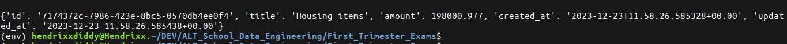

# Table of Contents

- [Fall Semester Data Engineering Exams](#fall-semester-data-engineering-exams)
  - [Synopsis](#synopsis)
  - [Classes](#classes)
    - [Expense Class](#expense-class)
    - [ExpenseDB class](#expensedb-class)
  - [How To Clone](#how-to-clone)
  - [How To Run](#how-to-run)
    - [Expense](#expense)
    - [ExpenseDB](#expensedb)
      - [Creating Instance[s] of Expense Records: `add_expense()`](#creating-instances-of-expense-records-add_expense)
      - [Removing an existing expense record[s]: `remove_expense()`](#removing-an-existing-expense-records-remove_expense)
      - [Retrieves an expense[s] by ID: `get_expense_by_id()`](#retrieves-an-expenses-by-id-get_expense_by_id)
      - [Retrieves an expense[s] by title: `get_expense_by_title()`](#retrieves-an-expenses-by-title-get_expense_by_title)
      - [Returns a list of dictionaries representing each expense: `to_dict()`](#returns-a-list-of-dictionaries-representing-each-expense-to_dict)
  - [Conclusion](#conclusion)


# Fall Semester Data Engineering Exams

## Synopsis
 The achieving goal of this project is to put to test and validate the knowledge OOP which we have ingested through out the the semester by implementing two classes that models and manages financial expenses.

## Classes

 ### Expense Class:
  This class represents an individual financial expense.
  
  Attributes:
   1. id: A unique identifier generated as a UUID string.
   2. title: A string representing the title of the expense.
   3. amount: A float representing the amount of the expense.
   4. created_at: A timestamp indicating when the expense was created (UTC).
   5. updated_at: A timestamp indicating the last time the expense was updated (UTC).
    
  Methods:
   1. `__init__`: Initializes the attributes.
   2. `update`: Allows updating the title and/or amount, updating the updated_at timestamp.
   3. `to_dict`: Returns a dictionary representation of the expense.
 
 
 ### ExpenseDB class
  Manages a collection of Expense objects.
  
  Attributes:
   1. expenses: A list storing Expense instances.
  
  Methods:
   1. `__init__`: Initializes the list.
   2. `add_expense`: Adds an expense.
   3. `remove_expense`: Removes an expense.
   4. `get_expense_by_id`: Retrieves an expense by ID.
   5. `get_expense_by_title`: Retrieves expenses by title.
   6. `to_dict`: Returns a list of dictionaries representing expenses.

## How To Clone
 To clone this repository code, navigate to the root directory and click on `code`.
 I use ssh, so i am clicking on ssh then C@P the url as shown in step1 below

  

- Step 1

  ```python
  git clone {url}
  ```

- Step 2

  Next we create and activate a virtual environment to install all the dependencies

  ```python
  python3 -m venv env
  ```

- Step 3

  Next, you activate the virtual environment

  ```bash
  source ./env/bin/activate
  ```

- Step 4

  Now that you have your virtual environment installed, Install the dependencies

  ```python
  pip3 install -r requirments.txt
  ```

- Step 5

  Create a `.env` file where you define your environment variables for postgres

  ```python
  touch .env
  ```

- Step 6

  Put the following lines in it

  ```python
  host={host}                # this by default should be `localhost`
  port=5432                  # unless otherwise, default is 5432
  dbname={name_of_database}  # the name of the database
  user={user}                # the name of the user/role
  password={password}        # user/roles passcode
  ```
 
- A sample look of how your `.env` file should look like

  

- Step 7

  Now you have created a role with a password and a database, with a schema('exams'). you can now go ahead to test your connection.

  To test your database connection, run the script `test_conn.py`

  ```python
  python3 test_conn.py
  ```

  You should get the name of your *host*, *port*,  *dbname*, *user* and *password*

  

Congratullations!!! Now that a connection is established, lets deep dive into the code.


## How To Run

### Expense

**Creating an Instance of Expense**

To create an individual instance of an expense, `try_expense.py` simulates simultaneously creating a number of instances.
All you need to is just to adjust the range(1 to infinity).

Have a look at  `try_expense.py`:

  

From the image above, I am only return 3 Expense instances. see the result below.

 ```python
 python3 try_expense.py
 ```

  


**Updating title or amount for an instance: `update()`**

Using a single instance to test the `update()` method

For the example below:

```python
Expense(title="House Hold Items", amount=200_000.43)
```

  

*Updating the title:*

```python
Expense(title="Housing items", amount=200_000.43)
```

  

*Updating the amount:*

```python
Expense(title="Housing items", amount=198_000.977)
```

  


### ExpenseDB

**Creating Instance[s] of Expense Records: `add_expense()`**

A single instance can be created or a number of instances can be created simultaneously depending on the the `n` just like explained in the above for *Expense* class

a portion of the main file to test ExpenseDB class methods: `try_expenseDB`

  

Generating 400 expense records, the command below should do just that for ya.

```python
python3 try_expenseDB.py
```

  


**Removing an existing expense record[s]: `remove_expense()`**

we currently have 400 expense records. sampling the removal of 350 records simultaneously records

   
  And More ...

  if an expense record does not exist and it wants to be removed, we check for the existense of its `id` to validate

  a view from dbeaver
  


**Retrieves an expense[s] by ID: `get_expense_by_id()`**

From the 50 records left, retrieving 10 expense records:
 
  

  *where `n` expenses can be retrieved.*

The Returned expenses...

  


**Retrieves an expense[s] by title: `get_expense_by_title()`**

Retrieving 5 expense Record:

  


**Returns a list of dictionaries representing each expense : `to_dict()`**

we will only return a list of 10 records only

  

## Conclusion

`try_expense.py` and `try_expennseDB.py` contains all needed to run and test the class methods.

*The assignment will test your proficiency in defining classes, utilizing class attributes and methods,and handling time-related functionalities.*
