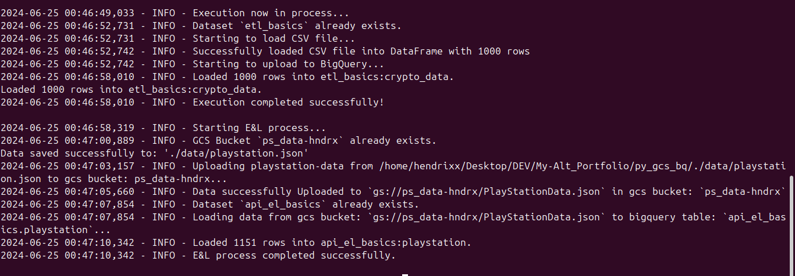
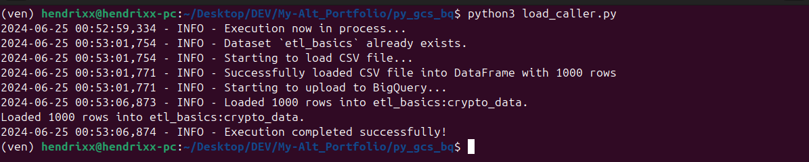
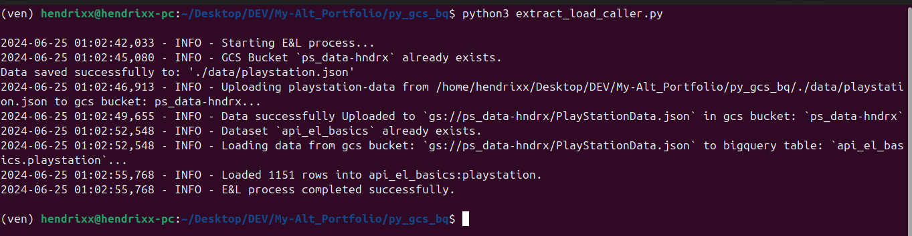

# Interacting with GCS and Bigquery from python

## Task
These program does two things:

1. Load flat files in csv format locally directly into a google bigquery table

2. Load data from an API into a GCS bucket as json/jsonl and into a bigquery table.

  ## _features_

   - *Idempotent:* The code is highly idempotent. 100 execution and you still get the same thing. no more no less.

   - *Reusable:* The code is `class based`, and not tightly coupled, i.e you can pickup the code and easily integrate anywhere without fears of landing into technical issues.

   - Environment variable are manage accordingly in the `.env` file

   - Proper logging of responses and pipeline progress.
   
   - _[apiextractandload.log](apiextractandload.log)_ keeps the of log of the file: _[extract_and_load.py](./src/extract_and_load.py)_

   - _[bigquerytransmiter.log](bigquerytransmiter.log)_ keeps the of log of the file: _[csv_to_bq.py](./src/csv_to_bq.py)_


## Execution

Simplifying the whole process, there is a bash script that install the dependencies: `requirements.txt` and executes the `config.py` which activates the program

## Sample

To run the bash script:

   ```console
   ./execute.sh



you can also run each caller independently:

   ```console
   python3 load_caller.py 



   ```console
   python3 extract_load_caller.py


